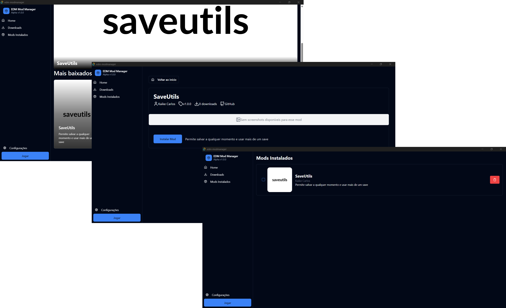

  <h1>EDM Mod Manager</h1>
  
  
  </a>

---

## Sobre 
O **EDM Mod Manager** é uma ferramenta para gerenciar mods do jogo *Enigma do Medo*.

Se você é um desenvolvedor de mod e deseja adicionar seu mod aqui, confira o repositório [edm-mod-db](https://github.com/kaikecarlos/edm-mod-db), onde você encontrará instruções de como prosseguir.

---

## Instalação
1. Acesse a [aba de releases](https://github.com/seu-repo/edm-mod-manager/releases).
2. Baixe o executável mais recente compatível com o seu sistema.
3. Siga as instruções de instalação na página de release.

---

Feito com [Tauri](https://tauri.app/) e [Preact](https://preactjs.com/).
